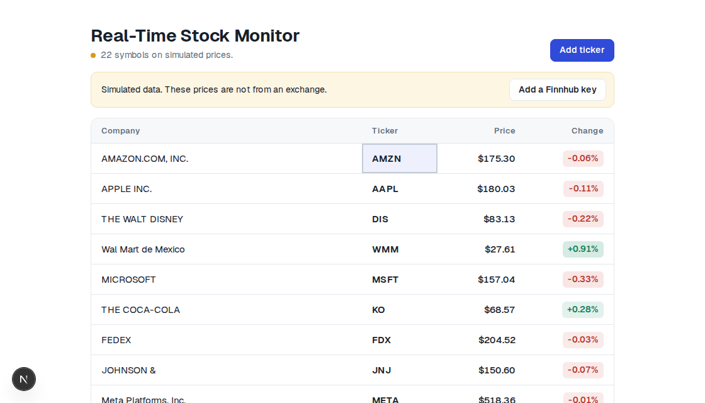

# Market Ratios

A spreadsheet in the browser that fills itself with stock prices.

The sheet starts in demo mode, so you can see it move before you create an account with a data vendor. Paste a free [Finnhub](https://finnhub.io/register) key when you want that vendor's prices. The browser sends the key to Finnhub. This app does not.



## Set up the demo

You need [Node.js 22](https://nodejs.org/). The repo pins pnpm 12.4.1 in `package.json`. Run the commands below from the repository root. The demo app is in `apps/demo`.

1. Clone the repository.

   ```bash
   git clone https://github.com/masaok/market-ratios.git
   cd market-ratios
   ```

2. Enable Corepack.

   ```bash
   corepack enable
   ```

3. Activate the pinned pnpm.

   ```bash
   corepack prepare pnpm@12.4.1 --activate
   ```

4. Install dependencies.

   ```bash
   pnpm install
   ```

   If pnpm reports that it ignored the esbuild build, confirm `pnpm-workspace.yaml` sets `esbuild: true` under `allowBuilds`. Run `pnpm install` again.

5. Start the demo.

   ```bash
   pnpm dev
   ```

6. Open [http://localhost:3000](http://localhost:3000).

The Monitor sheet lists 22 tickers. Prices change on a short timer. The banner says the data is simulated.

To run the production build on the same port, stop the dev server, then run:

```bash
pnpm build
pnpm --filter @market-ratios/demo start
```

## Use a Finnhub key

Create a free key at [Finnhub](https://finnhub.io/register). In the sheet, choose **Add a Finnhub key**, paste the key, and choose **Use key**.

Prices refresh every 5 minutes. The first request runs as soon as the key is saved. An invalid key stays on the key panel, and the sheet keeps the simulated prices. This browser stores the ticker list and the key.

`WMM` is in the default list because it is on the reference screenshot. Finnhub may not resolve it as a US ticker. That row shows `#N/A` when the provider has no name and no price.

## Deploy the demo

The Vercel project root is `apps/demo`.

[](https://vercel.com/new/clone?repository-url=https://github.com/masaok/market-ratios&project-name=market-ratios&root-directory=apps/demo)

## Packages

`@market-ratios/quotes` is the provider interface, the simulated provider, and the Finnhub adapter. It does not depend on React.

`@market-ratios/sheet` is the grid and the stock monitor. Give it a page and it renders the sheet.

Both packages are version 0.1.0 and are not published yet.

The comparison of free feeds is in [docs/providers.md](docs/providers.md). The licence position is in [docs/licensing.md](docs/licensing.md). To add a provider, read [CONTRIBUTING.md](CONTRIBUTING.md).

## Checks

```bash
pnpm typecheck
pnpm lint
pnpm test
```

`scripts/finnhub-spike.mjs` records a live Finnhub session when `FINNHUB_API_KEY` is set. Without that variable it prints whether the US cash session is open and exits.
